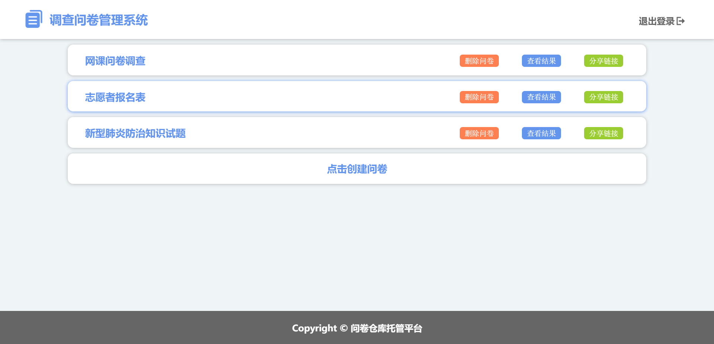
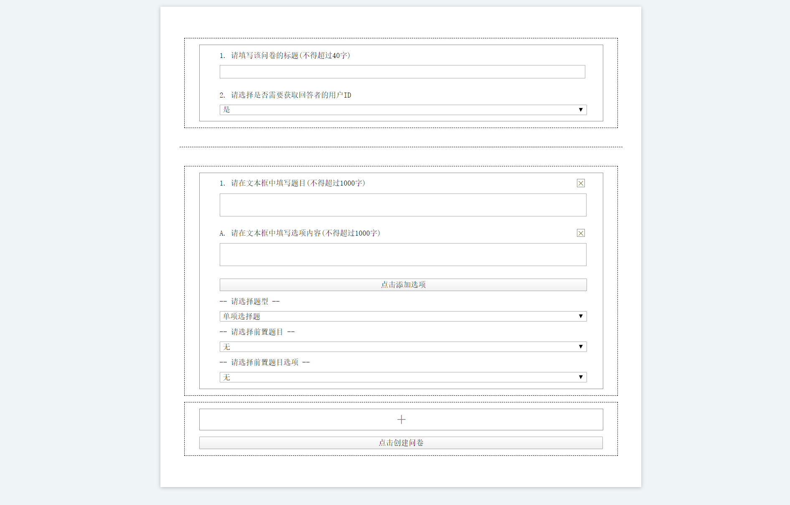
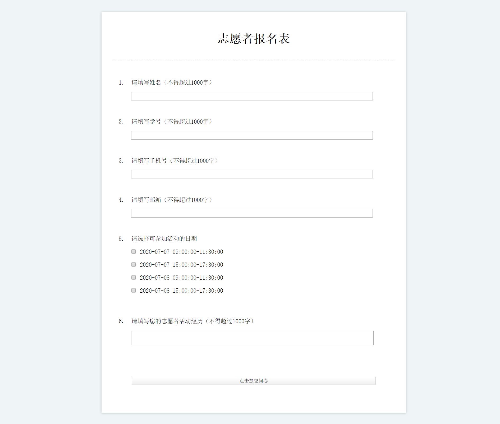
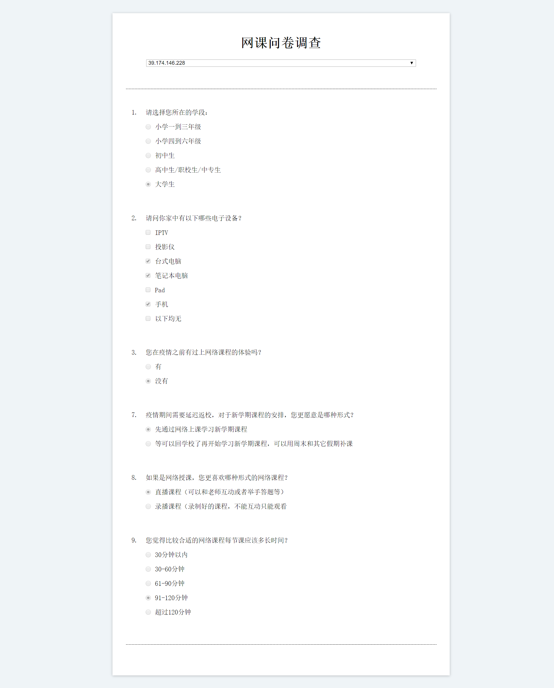

# Survey Admin System

This is a survey administration system implemented based on B/S architecture. It can complete creation, distribution, fill and delete of a survey. Any users or visitors can use it on the browser.

### Introduction

\- Architecture Build

This system is a B/S application. The front end uses HTML5 + CSS3 + JQuery and the server end uses NodeJS. The content structure of the web server is as follows.

```
> Survey_Admin_System (root)
    > App_Server
        > server
            - *.js
            ...
        - server.js
    > Data_Layer
        > sql
            - initial.sql
        - sql.js
    > File_System
        > css
            - *.css
            ...
        > html
            - *.html
            ...
        > img
            - *.png
            - *.jpg
            ...
        > js
            - *.js
            ...
```

This is the architecture of the whole system or web server. 

* ```File_System``` stores all the front end files which will be transformed to the browser and show UI after interpretion. Files in this folder are divided by their type or function.

* ```Data_Layer``` is the model interacts with mysql database. ```sql.js``` is the script used to carry out a specific mysql instruction. And the ```sql``` folder stores any sql scripts used to initial database, the ```initial.sql``` are not recommended to delete or modify because it builds the basic structure of the database. You can add anything.sql to insert initial data to fill the database.

* ```App_Server``` is the web server of this system. ```server.js``` is responsible to config the router of each service path. All kinds of services are stored in ```server``` folder and their import paths are configured by ```server.js```.

So, the architecture of this system is very clear, and it is easy to add any extensions no matter to the front end or the back end. If you want to add new web page, just insert the new resources into ```File_System``` according to the file type. If you want to add new service, just insert new extension script into ```App_Server/server``` and add its routing path into ```App_Server/server.js```.

\- Environment Prepare

According to the application architecture, you need to install the following tools.

* [NodeJS](https://nodejs.org/zh-cn/download/).

* [MySQL](https://dev.mysql.com/downloads/mysql/)

There are also some other dependencies needed to be install, NodeJS offers a package manager, npm. You can use the follow instructions to install these dependency packages with NodeJS npm.

```
npm install express
npm install mysql
npm install body-parser
npm install async
```

There dependencies are required in this version. If you develop any extensions using other dependencies, just install them as you wish.

\- Using Method

Download this repo and unzip it. You need to do some changes to adjust to your local attribution. Note: these operations cannot skip!

* Install all dependencies required.

* In ```App_Server/server.js```, you can modify the value in ```app.listen()``` to change the web server listen port. Here we set ```8080``` as default port number.

* In ```Data_Layer/sql.js```, you can modify parameters in ```mysql.createConnection()``` to adapt to local mysql connection.

* Carry out ```Data_Layer/sql/initial.sql``` in mysql terminal to build the database of this system. If you have any data prepared, just put these sqls into this folder and carry out them. Here, the recommended method for creating sql files is: Using this system to interact with database automatically and get sql file from database with the following instructions.


```
mysqldump -u root -p survey_admin_system user_info > user_info.sql
mysqldump -u root -p survey_admin_system survey_info > survey_info.sql
mysqldump -u root -p survey_admin_system survey_question > survey_question.sql
mysqldump -u root -p survey_admin_system survey_option > survey_option.sql
mysqldump -u root -p survey_admin_system answer_info > answer_info.sql
mysqldump -u root -p survey_admin_system option_answer > option_answer.sql
mysqldump -u root -p survey_admin_system text_answer > text_answer.sql
```

Note: The export filename should be at the correct absolute path!

Then you can turn to the App_Server folder in the terminal and enter the follow instruction to start the web server of this system.

```
node server.js
```

Turn to your browser, enter ```127.0.0.1:8080/index.html```. You come to the the system index page.


This page introduce the function and using method of this system. But if you want to use this system, firstly, you need to get an ID. So, at the top right part of this page. Click ```register``` or ```login```, you can jump to the corresponding page. Here, I show the register page and login page on the mobile browser.


When you log in with your ID, you will enter user home page. In this page, you can check the surveys you published, delete any one of them and get their share link.



You can click on creating a survey, then you will jump to edit page.



Firstly, you need to fill the title and the authority of getting user's ID. Then you can click the plus signal at the bottom to insert a problem below. You can delete any problem by clicking the cross signal at the top right of the problem. When you create a problem, the first thing you need to do is selecting the type of it. If you change the type of a problem to single selection or multiple selection, an adding option button will occur below the title filling texture of this problem. You can click this button to add an option below or click on the cross signal corresponding to any option to delete one. You can also select a pre-problem and a pre-option for a problem, but in this situation, the type of pre-problem must be single selection. If editor defines a problem with pre-selection, then this problem will not display on a user's screen initially until he selects the pre-option for the pre-problem. After finishing editing, you can click on the button at the bottom of the page to publish this survey and you will return to home page automatically.

There are three buttons on each survey. You can click on delete to drop this survey from database. Note: Delete the survey will not only drop the questions of this survey but also clear all the answers of this survey. You can click on share link to get the filling share link. Click this button, the share link will automatically copy to the system clipboard. Then you can share this link to your friends, workmates, anyone you wish.

When a visitor get the share link, he just start his browser, paste the link on the address bar and he will come to the fill page.



Fill all the questions and click on submit is ok. Here there are two tips.

* If this survey requires your ID, you need to login firstly. If you are not at online status, you will jump to the login page automatically and return to this page after login.

* Some problems with pre-request will not display initially until you select the specific option of a specific question.

Finally, you can click on the check result button to check the results of a survey.



You can select which user's or visitor's answer you would like to check from the selection texture below the title.

### Design Detail

Generally, this system supports browsers on both PC and mobile. The size of page is able to adjust the ratio of the width and height of the browser automatically. Here I implement this function with changing series of standard size using original js.

For the view layer, this system users some effects from Html5 and Css3, especially in the index page. I uses SVG, animations and transitions, and the header can change the background style between pure color and a picture with the changes of page's scrolling state.

In this system, there is a very important regulation which called cookie management. When a user enter home page, edit page or result page, such pages need the user login information, the system will check cookies. So, there exists a cookie ```user_name``` to record which user is online on the current browser. The cookie setted when a user login on the local browser, the term of validity is three days. Note: this term is calculated from the time when the user log out. So, a core trigger is setted in the cookie manage system that it renew the ```user_name``` cookie info every ten minutes when the user is online.

```
$(document).ready(function() {
    if (get_cookie("user_name") != undefined)
        setInterval("renew_cookie()", 600000);
})
```

Another regulation uses cookie is the page link jumping. For example, when a visitor gets a survey share link, while this survey requires the visitor's user ID. So, when he enter te fill page, the first thing the system does is checking the ```user_name``` cookie, it is ```undefined``` for a visitor. Then the system will jump to login page automatically to get the visitor's user info, and after that the system should jump back to this fill page location link. Generally, the system jump to home page after login completed. Here, the system uses a cookie called ```edit_log``` to record the jumping link, if the value of this cookie is undefined, or no jumping target exits, system will jump to the default location page. Abviously, the jumping target needs to pre-assign for this cookie before jumping.

As for the above example, in fill page, system sets the value this cookie itself, then jump to login page.

```
if (form.ifID) {
    userID = get_cookie("user_name");
    if (userID != undefined) {
        console.log("--user info--");
        console.log("'user_id': " + userID);
        renew_cookie();
    }
    else {
        set_cookie("edit_log", window.location, 1 / 144,  "/");
        alert("请先登录");
        $(location).attr("href", "http://127.0.0.1:8080/login.html");
    }
}
```

While in login page, system firstly checks the location cookie, if no request exits, jump to the default target location, else, jump to the location recorded by the cookie.

```
if (get_cookie("edit_log") == undefined)
    $(location).attr("href", "http://127.0.0.1:8080/home.html");
else {
    locationHref = get_cookie("edit_log");
    clear_cookie("edit_log", "/");
    $(location).attr("href", locationHref);
}
```

As for the survey share link, the requirement is copy the url to the clipboard automatically. Here is the algorithm. Javascript supplies an API which can copy content from a entity to the system clipboard, we should use this API. So, firstly, we should create such an entity dynamically, then execute copy command and finally clear this entity to maintain the original static web page.

```
var tag = document.createElement('input');
tag.setAttribute('id', 'cp_zdy_input');
tag.value = shareAddr;
document.getElementsByTagName('body')[0].appendChild(tag);
document.getElementById('cp_zdy_input').select();
document.execCommand('copy');
document.getElementById('cp_zdy_input').remove();
```

In fact, the fill page and result page are templates. For each specific fill page and result page, the link are different. When system loads these pages, the first thing is parsing url, get the survey identity info from link and fetch the corresponding content from database to fill the initial blank survey.

Above is about some techonologies in front-end, the back-end also have some difficulties.

The most common problem is tasks synchronization. Because nodejs is asynchronous, many times the next task has been executed while the current task hasn't been completed. In this system, the server needs to response with database queries's results, so nodejs must wait until mysql query finished. The common regulation used in nodejs is callback. We can set a sql query task as a callback function. This method is effective but it also generates a problem, callback black hole. When a requests have many ordered sql querys one time, the above algorithom will generate amounts of callbacks as follows.

```
function(..., function(..., function(..., function(..., function(...) {
    ...
}) {
    ...
}) {
    ...
}) {
    ...
}) {
    ...
}
```

Such codes are really terrible. You can hardly understand each function and their relationships. So, here we introduce ```async``` key word. A task series can be written as follows.

```
var task_1 = function(..., callback) {
    ...
    callback()
    ...
}

var task_2 = function(..., callback) {
    ...
    callback()
    ...
}

var task_3 = function(..., callback) {
    ...
    callback()
    ...
}

...

async.series([task_1, task_2, task_3, ...], function(err, data) {
    if (err)
        ...
    else
        ...
})
```

Notes: The first parameter is the list of tasks, the second parameter is the callback function used by each task. This method can not only solve tasks synchronization but also maintain a good code style.

### Future Extension

The UI design and the basic function of this system is already perfect. But the function is just basic and simple. The user center or say the home page can just implement creation and delete of surveys. And the result page can just display the original result of each ID or IP. So, here I have two ideas.

\- Increasing Draft Function

In edit page, user can choose whether publish the survey directly or save it as a draft. Drafts and published surveys have several differents.

* The published surveys have share links while drafts don't. This means drafts cannot be filled or be seen by any other visitors.

* Drafts can be modified and deleted while published surveys can just be deleted.

* The published surveys have result pages while drafts don't.

Note: The requirement description is simple but it means we must change the structure of the database. The most difficult thing is to determine how to redesign the database can make the least change to the original structure.

\- Result Visualization

The result display is too simple in this version. We can add data visualization techonology to the result. For example, the results of a selection problem can be represented by various echarts and texts can be rendered to word clouds.

This amount of this work is less than the first task, but this work needs a detailed render plan.

\- Survey Template Base

We could consider pre-stored or initially input some standarded survey info into database as sample or templates. The way of creating surveys supports two methods. One is the current method, called creating based on zero. The other is creating based on templates. The edit page will initially filled with the template, than users can modify it and published. Just pay attention to the authority is ok.
